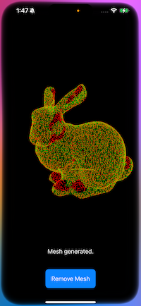

# BPA_Library for iOS

## Overview

This project modifies the Ball Pivoting Algorithm (BPA) module from Open3D to make it compatible with PCL (Point Cloud Library) and usable in iOS projects. The library enables high-quality mesh reconstruction from point clouds.



## Features

- **Optimized for PCL**: The BPA module has been adapted to work seamlessly with PCL.
- **iOS-ready**: The library is tailored for iOS development and can be built using an appropriate toolchain.
- **Efficient mesh reconstruction**: Generates meshes from input point clouds.

## Requirements

This project depends on several third-party libraries. Their source code is **not included** in this repository. Please acquire and build these libraries separately:

- [PCL (Point Cloud Library)](https://github.com/PointCloudLibrary/pcl)
- [Boost](https://www.boost.org/)
- [FLANN](https://github.com/mariusmuja/flann)
- [Qhull](http://www.qhull.org/)
- [LZ4](https://github.com/lz4/lz4)

## Installation

### Step 1: Install dependencies
1. **PCL**: Follow the build instructions at [PCL GitHub](https://github.com/PointCloudLibrary/pcl).
2. **Boost**: Download and build Boost from [Boost.org](https://www.boost.org/).
3. **FLANN**: Follow the instructions at [FLANN GitHub](https://github.com/mariusmuja/flann).
4. **Qhull**: Build Qhull from [Qhull.org](http://www.qhull.org/).
5. **LZ4**: Download and build LZ4 from [LZ4 GitHub](https://github.com/lz4/lz4).

### Step 2: Build the BPA library
Use the provided `CMakeLists.txt` file to build the library for iOS. Ensure that the necessary toolchain and dependencies are correctly set up.

```bash
mkdir build-ios
cd build-ios
cmake -DCMAKE_TOOLCHAIN_FILE=../iOS.cmake ..
make
```

## Usage

Integrate the resulting static library into your iOS project. Use the `BallPivoting` class and the `RunBPA` function to perform mesh reconstruction from point clouds and their normals.

## Example

Below is an example output of the Ball Pivoting Algorithm applied to a point cloud:


The above image showcases the reconstructed mesh of a bunny model generated using this library.

## License

This project is licensed under the [MIT License](LICENSE).

### Open3D License

This project includes modifications to the Ball Pivoting Algorithm (BPA) module from [Open3D](https://github.com/intel-isl/Open3D), which is licensed under the MIT License. The original license is as follows:

```
MIT License

Copyright (c) 2018-2024 Intel Corporation and the Open3D contributors

Permission is hereby granted, free of charge, to any person obtaining a copy of this software and associated documentation files (the "Software"), to deal in the Software without restriction, including without limitation the rights to use, copy, modify, merge, publish, distribute, sublicense, and/or sell copies of the Software, and to permit persons to whom the Software is furnished to do so, subject to the following conditions:

The above copyright notice and this permission notice shall be included in all copies or substantial portions of the Software.

THE SOFTWARE IS PROVIDED "AS IS", WITHOUT WARRANTY OF ANY KIND, EXPRESS OR IMPLIED, INCLUDING BUT NOT LIMITED TO THE WARRANTIES OF MERCHANTABILITY, FITNESS FOR A PARTICULAR PURPOSE AND NONINFRINGEMENT. IN NO EVENT SHALL THE AUTHORS OR COPYRIGHT HOLDERS BE LIABLE FOR ANY CLAIM, DAMAGES OR OTHER LIABILITY, WHETHER IN AN ACTION OF CONTRACT, TORT OR OTHERWISE, ARISING FROM, OUT OF OR IN CONNECTION WITH THE SOFTWARE OR THE USE OR OTHER DEALINGS IN THE SOFTWARE.
```

For the full text, see the [Open3D LICENSE](LICENSE).

## Acknowledgments

- **Open3D**: Original BPA module source.
- **PCL**: Used for point cloud operations.
 
